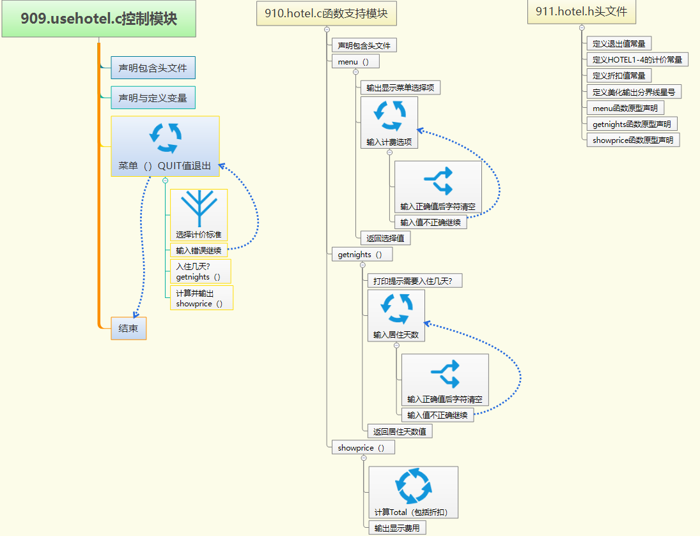

## 第9章 函数 

### 在本章中您将学习下列内容：
- 关键字：  
  return  

- 运算符：  
  *(一元)&(一元)  

- 函数及其定义方式。  

- 参数和返回值的使用方法。  
  
- 使用指针变量作为函数参数。  
  
- 函数类型。  
  
- ANSI C原型。  
  
- 递归。  


  
### 程序清单：
[9.1 lethead1.c (声明函数原型、使用函数、函数定义)](C_Primer_Plus_code/901/main.c)  
[9.2 lethead2.c (常量与函数)](C_Primer_Plus_code/902/main.c)  
[9.3 lesser.c (函数传参与返回值)](C_Primer_Plus_code/903/main.c)  
[9.4 misuse.c (旧式函数以及缺少参数)](C_Primer_Plus_code/904/main.c)  
[9.5 proto.c (函数缺少参数与改正)](C_Primer_Plus_code/905/main.c)  
[9.6 recur.c (递归举例)](C_Primer_Plus_code/906/main.c)  
[9.7 factor.c (使用循环和递归计算阶乘)](C_Primer_Plus_code/907/main.c)  
[9.8 binary.c (递归求二进制值)](C_Primer_Plus_code/908/main.c)  
[9.9 usehotel.c (多文件编程之控制模块)](C_Primer_Plus_code/909/main.c)  
[9.10 hotel.c (多文件编程之函数支持模块)](C_Primer_Plus_code/909/hotel.c)  
[9.11 hotel.h (多文件编程之自定义头文件)](C_Primer_Plus_code/909/hotel.h)  
[9.12 loccheck.c (查看变量的内存存储地址)](C_Primer_Plus_code/912/main.c)  
[9.13 swap1.c (数据交换之错误版)](C_Primer_Plus_code/913/main.c)  
[9.14 swap2.c (数据交换之调用打印)](C_Primer_Plus_code/914/main.c)  
[9.15 swap3.c (数据交换之指针完成交换)](C_Primer_Plus_code/915/main.c)  
 

### 知识点：
- 函数概述  
  什么是函数？函数(function)是用于完成特定任务的程序代码的自包含单元。尽管C中的函数和其他语言中的函数、子程序或子过程等扮演着相同的角色，但是在细节上会有所不同。某些函数会导致执行某些动作，比如printf（）可使数据呈现在屏幕上；还有一些函数能返回一个值以供程序使用，如strlen（）将指定字符串的长度传递给程序。一般来讲，一个函数可同时具备以上两种功能。  
  
- 为什么使用函数？
  第一，函数的使用可以省去重复代码的编写。如果程序中需要多次使用某种特定的功能，那么只需编写一个合适的函数即可。程序可以在任何需要的地方调用该函数，并且同一个函数可以在不同的程序中调用，就像在程序中需要使用putchar（）函数一样。  
  第二即使某种功能在程序中只使用一次，将其以函数的形式实现也是必须的，因为函数使得程序更加模块化，从而有利于程序的阅读，修改和完善。  
  
- 对函数需要了解什么？  
  您需要掌握如何正确定义函数、如何调用函数和如何建立函数间的通信。  
  函数原型(function prototype)告知编译器属于什么函数类型，函数调用(function call)导致该函数的执行，而函数定义(function definition)则确切指定了该函数的具体功能。  
  
  函数同变量一样有多种类型。任何程序在使用函数之前都需要声明该函数的类型。  
  ``` void starbar(void);```  
  注意：一些老版本的编译器不能识别void类型。这时，需要把没有返回值的函数声明为int类型。  
  
  程序把函数原型置于main（）之前；也可以将其置于main（）之内，可以放在置变量声明的任何位置。  
  
  程序在main（）中通过使用函数名后跟圆括号和分号的格式调用函数。  
  
  执行完函数调用的代码后，计算机返回到调用函数(calling function)的下一行继续执行。  
  
  定义的函数与main（）具有相同的格式，即首先以类型、名称和圆括号开始，接着是开始花括号、变量声明、函数语句定义以及结束花括号。  
  
  定义的函数您也可以将他们放在不同的两个文件之中。单文件形式比较容易编译，而使用两个文件则有利于在不同的程序中使用相同的函数。如果您把函数写在了另外一个单独的文件中，则在哪个文件中必须加入#define和#include指令。  
  
  函数中的变量名是一个局部变量(local)。即使您在其他的函数中使用同样名称（包括main（）函数），也不会出现任何冲突，您将得到具有同一名称的多个独立的、互不相关的变量。  
  
- 形式参量  
  ```void show_n_char(char ch, int num)```
  这行代码通知编译器show_n_char()使用名为ch和num的两个参数，并且这两个参数的类型分别是char和int。变量ch和num被称为形式参数(formal argument)或形式参量(formal parameter这个名称更正式)。如同函数内部定义的变量一样，形式参量是局部变量，它们是函数所私有的。这意味着可以在其他函数中使用相同的变量名。每当调用函数时，这些变量就会被赋值。  
  
  ANSI C形式要求在每个变量前声明其类型。也就是说不能像通常的变量声明那样使用变量列表来声明同一类型的变量：  
  ```void dibs(int x, y, z)```不正确的函数头  
  ```void dubs(int x, int y, int z)```正确的函数头  
  
- 带参数函数的原型声明  
  ```void show_n_char(char ch, int num);```  
  当函数接受参数时，函数原型通过使用一个逗号分隔的类型列表指明参数的个数和类型。在函数原型中可以根据您自己的喜好省略变量名：  
  ```void how_n_char(char, int);```  
  在原型中使用变量名并没有实际地创建变量。这只说明char代表了一个char类型变量。  
  ANSI C也支持旧的函数声明形式，即圆括号内不带有任何参数：  
  ```void show_n_char();```  
  这种形式最终将会被从标准中删除。即使没有删除，原型形式设计比它更具有优势，了解这种形式的主要原因只是为了您能正确识别并理解以前的代码。  
	
- 调用带有参数的函数：实际参数  
```void show_n_char(char ch, int num);```  
  函数调用中，通过使用实际参数(actual argument)对ch和num赋值。而实际参数是调用函数分配给被调用函数变量的特定数值。  
  
- return从函数中返回一个值  
  关键字return指明了其后的表达式的数值既是该函数的返回值。返回值可以由任何表达式计算得出，而不是仅仅来自于变量。  
  return语句的另一个作用是终止执行函数，并把控制返回给调用函数的下一个语句。所以在return后面的语句可能是无效的。  
  
- 函数类型  
  函数应该进行类型声明。同时其类型应和返回值类型相同。而无返回值的函数应该被声明为void类型。在早期版本的C语言中，如果函数没有进行类型声明，则该函数具有默认的函数类型int。使用这种默认类型的原因是早期大多数C语言函数都是int类型的。但是，C99标准不再支持函数的int类型的默认设置。  
	```
	#include <stdio.h>  
	int imin(int, int);  
	int main(void)  
	{  
	int evil1, evil2, lesser;  
	...  
	
	#include <stdio.h>  
	int main(void)  
	{  
	int imin(int, int);  
	int evil1, evil2, lesser;  
	...  
	```  
  这两种形式中，需要重点注意的是函数声明要在使用函数之前进行。  
  但是不要把函数声明和函数定义混淆。函数声明只是将函数类型告诉编译器，而函数定义部分则是函数的实际实现代码。  
```int imax(int,int);```  
```int imax(int a, int b);```  
  第一种形式使用逗号对参数类型进行分隔；而第二种形式在类型后加入了变量名。需要注意的是这些变量事实虚设的名字，它们不必和函数定义中使用的变量名相匹配。  
  使用这种函数原型信息，编译器就可以检查函数调用语句是否和其原型声明相一致。比如检查参数个数是否正确，参数类型是否匹配。如果有一个参数类型不匹配但都是数值类型，编译器会把实际参数值转换成形式参数类型相同的数值。例如：会把imax(3.0,5.0)换成imax(3,5)。
  
- 无参数和不确定参数  
```void print_name();```  
这时ANSI C编译器会假设您没有用函数原型声明函数，他就不会进行参数检查。因此，为了表示一个函数确实不使用参数，需要再圆括号内加入void关键字：```void print_name(void);```  
  ANSI C会把上句解释为print_name()不接受任何参数，因此当对该函数进行调用时编译器就会检查以保证您确实没有使用参数。一些函数（比如printf（）和scanf（））使用的参数个数是变化的。例如在printf()中，第一个参数是一个字符串，而其余参数的类型以及参数个数并不固定。对于这种情况，ANSI C允许使用不确定的函数原型。  
```int printf(char *, ...);```  
  这种原型表示第一个参数是一个字符串（在第11章字符串和字符串函数中纤细解释了这一知识），而其余不能确定。  
  对于参数个数不确定的函数，C库通过stdarg.h头文件提供了定义该类函数的标准方法。（有关该内容在C预处理和C库有详细叙述）  
  
- 函数原型的优点  
  函数原型是对语言的有力补充。它可以使编译器发现函数使用时可能出现的错误或疏漏。而这些问题如果不被发现的话，是很难跟踪调试出来的。您可以不使用函数原型，而使用旧的函数声明形式，但是这么做不仅没有任何优势反而存在许多缺点。  
  有一种方法可以不使用函数原型却保留函数原型的优点。之所以使用函数原型，是为了在编译器编译第一个调用函数的语句之前向其表面该函数的使用方法。因此，可以在首次调用某函数之前对该函数进行完整定义。  
  
- 递归  
  C允许一个函数调用其本身。这种调用过程被称作递归(recursion)。递归有时很难处理，而有时却很方便实用。当一个函数调用自己时，如果编程中没有设定可以终止递归的条件检测，他会无限制地进行递归调用，所以需要谨慎处理。  
  
  递归一般可以代替循环语句实用。有些情况下使用循环语句比较好，而有些时候使用递归更有效，递归方法虽然使程序结构优美，但其执行效率却没有循环语句高。  
  
- 递归使用  
  函数调用自身时我们把这次调用称为“第1级递归”，然后再调用其本身，这次调用叫做“第2级递归”，第2级递归调用第3级递归，以此类推。
  
  每一级的递归都使用它自己私有的变量。  
  
  如果您对此感到有些迷惑，可以假想进行了一系列函数调用，即使用fun1（）调用fun2（）、fun2（）调用fun3（），fun3（）调用fun4（）。fun4（）执行完后，如果有返回值，返回到fun3（），继续执行fun3（），再继续执行fun2（），最后执行fun1（）。递归过程也是如此，只不过fun1（）、fun2（）、fun3（）和fun4（）是相同的函数。  
  
- 递归的基本原理  
  刚接触递归可能会感到迷惑，下面将讲述几个基本要点以便于理解该过程：  
  第一，每一级的函数调用都有自己的变量。  
  第二，每一次函数调用都会有一次返回。中间过程不能直接返回到mian（）中的初始调用部分，而是通过递归的每一级逐步返回。  
  第三，递归函数中，位于递归调用前的语句和各级被调函数具有相同的执行顺序。  
  第四，递归函数中，位于递归调用后的语句的执行顺序和各个被调函数的顺序相反。  
  第五，虽然每一级递归都有自己的变量，但是函数代码并不会得到复制。函数代码是一系列的计算机指令，而函数调用就是从头执行这个指令集的一条命令。一个递归调用会使程序从头执行相应函数的指令集。除了为每次调用创建变量，递归调用非常类似于一个循环语句。通常情况下递归会使用一个if条件语句或其他类似的语句以便当函数参数达到某个特定值时结束递归调用。  
  
- 尾递归  
  最简单的递归形式是把递归调用语句放在函数结尾即恰在return语句之前。这种形式被称为尾递归(tail recursion)或结尾递归(end recursion)，因为递归调用出现在函数尾部。由于尾递归的作用相当于一条循环语句，所以它是最简单的递归形式。  
  
  既然循环和递归都可以用来实现函数，那么究竟选择哪一个呢？一般来讲，选择循环更好一些。首先，因为每次递归调用都拥有自己的变量集合，所以就需要占用较多的内存；每次递归调用需要把新的变量集合存储在堆栈中。其次，由于进行每次函数调用需要花费一定的时间，所以递归的执行速度较慢。既然如此，那么我们为什么还要讲述以上例子呢？因为尾递归是最简单的递归形式，比较容易理解；而且在某些情况下，我们不能使用简单的循环语句代替递归，所以就有必要学习递归的方法。  
  
- 递归的优缺点  
  使用递归既有优点也有缺点。其优点在于为某些编程问题提供了最简单的解决方法，而缺点是一些递归算法会很快耗尽计算机内存资源。同时，使用递归的程序难于阅读和维护。  
  有些函数内会创建多个变量，如果使用多级递归调用所创建的变量会成指数增长，这种情况下，会占用大量内存，可能导致程序瘫痪。  
  
- 多文件编译  
  - UNIX  
    首先假定UNIX系统下安装了标准的编译器cc。文件file1.c和file2.c中包含有C的函数。下面的命令将把这两个文件编译在一起并生成可执行文件a.out：  
```cc file1.c file2.c```  
	
  - Linux  
    首先假定Linux系统下安装了GUN C编译器gcc。文件file1.c和file2.c中包含有C的函数。下面的命令将把这两个文件编译在一起并生成可执行文件a.out：  
``` gcc file1.c file2.c```  
	
  - DOS命令行编译器  
    大多数DOS命令行编译器的工作机制同UNIX系统下的cc命令类似。一个不同之处在于DOS系统下目标文件的扩展名是.obj而不是.o。而且有些编译器并不生成目标代码文件，而是生成汇编语言或其他特殊代码的中间文件。  
	
  - Windows和Macintosh编译器  
    Windows和Macintosh系统下的编译器是面向工程的。工程(project)描述了一个特定的程序所使用的资源。这些资源包括源代码文件。使用这种编译器运行单文件程序时，必须创建工程。而对于多文件程序，需要使用相应的菜单命令将源代码文件加入到一个工程之中。而且，工程必须包括所有的源代码文件(扩展名为.c的文件)，但是头文件(扩展名为.h的文件)不能包括在工程之中。因为工程只管理所使用的源代码文件，而使用哪些头文件需要由源代码文件中的#include指令确定。  
	
  - 头文件的使用  
    如果把main（）函数放在第一个文件中而把自定义函数放在第二个文件中实现，那么第一个文件仍需要使用函数原型。如果把函数原型放在一个头文件中，就不必每次使用这些函数时输入其原型声明。这也是C标准库的做法，比如输入/输出函数的原型声明放在stdio.h中，把数学函数的原型声明放在math.h之中。对于包含自定义函数的文件也可以这样做。  
	编写程序的过程中需要经常使用C的预处理器定义常量。而定义的常量只能用于包含相应#define语句的文件。如果程序中的函数分别放在不同的文件之中，那么就必须使定义常量的#define指令对每个文件都可用。而直接在每个文件中键入该指令的方法既耗时又容易出错，同时也会带来一个维护上的问题：即如果修改一个使用#define定义的数值，那么必须在每一文件中对其进行修改。比较好的解决方法是把所有的#define指令放在一个头文件中，既然在每个源代码文件中使用#include语句引用该头文件。  
	总之，把函数原型和常量定义放在一个头文件中是一个很好的编程习惯。  
	
	
- 地址运算符：&  
C中最重要的（有时也是最复杂的）概念之一就是指针(pointer)，也就是用来存储地址的变量。当需要改变调用函数中的某个数值时，任何被调用的无返回值的C函数都需要使用地址参数来完成该任务。这个时候就会用到一元运算符&，下一章有介绍它的使用方法。  
  
- 数据交换（两个变量）  
```temp = x;```  
```x = y;```  
```y = temp;```  

- 指针简介  
  究竟什么是指针？  
  一般来讲，指针是一个其数值为地址的变量（或是一般地说是一个数据对象）。正如char类型的变量用字符作为其数值，而int类型变量的数值是整数，指针变量的数值表示的是地址。指针在C中有很多用途，本章将研究把它作为函数参数的方法和理由。  
  如果您将某个指针变量命名为ptr，就可以使用如下语句：  
```ptr = & pooh; //令ptr指向bah而不是pooh```  
  对于这个语句，我们称ptr指向pooh。ptr和&pooh的区别在于前者为一变量，而后者是一个常量。当然，ptr可以指向任何地方：  
```ptr = & bah; //令ptr指向bah而不是pooh```  
  这时ptr的值是bah的地址。  
  
- 间接运算符：*  
  假定ptr指向bah，这时就可以使用间接(indirection)运算符\*(也称作取值（dereferencing)运算符)来获取bah中存放的数值（不要把这种一元运算符和表示乘法的二元运算符*相混淆）。  
```val = * ptr;  //得到ptr指向的值```  
  语句ptr=&bah；以及语句val=*ptr；放在一起等同于下面的语句：  
```val = bah;```  
  由此看出，使用地址运算符和间接运算符可以间接完成上述语句的功能，这也正是“间接运算符”名称的由来。  
  
  - 地址运算符：&，后跟一个变量名时，&给出该变量的地址。
  - 间接运算符：\*，当后跟一个指针名或地址时，*给出存储在被指向地址中的数值。  

- 指针声明  
  我们已讲述了int类型变量以及其他基本数据类型变量的声明方法。那么应该如何声明指针变量呢？您也许会猜想其声明形式如下：
  ```pointer ptr;  //不能这样声明一个指针```  
  因为这对于声明一个变量指针是不够的，还需要说明指针所指向变量的类型。原因是不同的变量类型占用的存储空间大小不同，而有些指针操作需要知道变量类型所占用的存储空间。同时，程序也需要了解地址中存储的是何种数据。例如，long和float两种类型的数值可能使用相同大小的存储空间，但是它们的数据存储方式完全不同。指针的声明形式如下:  
```int * pi; //pi是指向一个整数变量的指针```  
```char * pc; //pc是指向一个字符变量的指针```  
```float * pf, * pg; //pf和pg是指向浮点型变量的指针```  
  类型标识符表面了被指向变量的类型，而星号\*标识该变量为一指针，声明int * pi；的意思是pi是一个指针，而且*pi是int类型的  
  
  *和指针名之间的空格是可选的。通常程序员在声明中使用空格，而在指向变量时将其省略。  
  
  pc所指向的值（*pc）是char类型的。而pc本身又是什么类型？我们把它描述为“指向char的指针”类型。pc的值是一个地址，在大多数系统内部，它由一个无符号整数表示。但是，这并不表示可以把指针看作是整数类型。一些处理整数的方法不能用来处理指针，反之亦然。例如，可以进行两整数相乘，而指针则不能。因此指针的确是一种新的数据类型，而不是一种整数类型。所以，正如前面提到的，ANSI C专门为指针提供了%p输出格式。  
  
  其他函数通过使用指针，可以操作main（）中的变量的值。
  
  编写程序时，一个变量一般有两种属性：变量名和数值（当然还有其他属性，如数据类型等，但它们与这个主题无关）。程序被编译和加载后，同一个变量在计算机中的两个属性是地址和数值。变量的地址可以被看作是在计算机中变量的名称。  
  
  在许多编程语言中，变量地址只由计算机处理，对于编程人员来讲完全不可见。但是在C中，可以使用运算符&对变量的地址进行操作。  
  
  普通的变量把它的数值作为基本数质量，而通过使用运算符&将它的地址作为间接数值量。但是对于指针来讲，地址是它的基本数值量，使用运算符*后，该地址中存储的数值是它的间接数质量。  
  
  初学者也许会将地址打印出来以满足好奇心，但这并不是&运算符的主要用途。更重要的是，使用&、*和指针可以方便地操作地址以及地址中的内容。  
  
  
### 关键概念
  要想用C编写出灵活高效的程序，您必须正确理解函数的使用。把较大的程序组织成若干个函数的形式是很有用，甚至是很关键的。如果每个函数实现了某一特定功能，那么，这样的程序既易于理解又便于调试。另外，您还需要理解函数之间的信息传递机制，也就是明白函数参数以及返回值是如何工作的。因为函数的参数和其他局部变量的函数所私有的，所以在不同函数中声明的同名变量是完全不同的。而且何函数不能直接访问其他函数中声明的变量。这种操作的局限性有助于保护数据的完整性。然而，当确实需要在一个函数中访问其他函数中的数据时，可以使用指针参数。  
  
  
### 总结
  函数可以作为大型程序的组成模块。每个函数应该实现某个明确的功能。使用参数可以向函数传递数值，并且通过关键字return让函数返回一个数值。如果函数返回值的类型不是int，那么必须在函数定义中以及调用函数的声明部分指定函数的返回值类型。如果需要再一个函数中操作它的调用函数中的变量，那么可以使用地址以及指针。  
  
  在ANSI C中可以使用函数原型声明，以便编译器检查函数调用时所传递的参数个数及类型是否正确。  
  
  C函数可以调用其自身，这种调用方式被称作递归。有些编程问题借用递归解决方案，但是递归可能会在内存使用和时间花费方面效率低下。  


### 复习题
1、实际参数和形式参量有何不同？
<details>
     <summary>答：</summary>

	形式参量是函数原型通知编译器所使用的数据类型  
	实际参数是传入函数的具体数值。  
 </details>  
<br/>  

2、写出下面所描述的各个函数的ANSI函数头。注意：只写出函数头即可，不需要实现。
a.donut()接受一个int类型的参数，然后输出若干个0，输出0的数目等于参数的值。
b.gear()接受两个int类型的参数并返回int类型的值。
c.stuff_it()的参数包括一个double类型的值以及一个double类型变量的地址，功能是把第一个数值存放到指定的地址中。
<details>
     <summary>答：</summary>

	a. void donut(int)  
	b. int gear(int, int)  
	c. void stuff_it(double, double *x)
 </details>  
<br/>  

3、只写出下列函数的ANSI C函数头，不需要实现函数。
a.n_to_char()接受一个int类型的参数并返回一个char类型的值。
b.digits()接受的参数是一个double类型的数值和一个int类型的数值，返回值类型是int。
c.random()不接受参数，返回int类型的数值。
<details>
     <summary>答：</summary>

	a. char n_to_char(int)  
	b. int digits(double, int)  
	c. int random(void)  
 </details>  
<br/>  

4、设计一个实现两整数相加并将结果返回的函数。
<details>
     <summary>答：</summary>

	int add(int a, int b)  
	{  
		int x;  
		x = a + b;  
		return x;  
	}  
 </details>  
<br/>  

5、假如问题4中的函数实现两个double类型的数值相加，那么应该如何修改原函数？
<details>
     <summary>答：</summary>

	double sum(double a, double b)
	{  
		double x;  
		x = a + b;  
		return x;  
	}  
 </details>  
<br/>  

6、设计函数alter()，其输入参数是两个int类型的变量x和y，功能是分别将这两个变量的数值改为它们的和以及它们的差。
<details>
     <summary>答：</summary>

	void alter(int *x, int *y)  
	{  
	    int he, cha;  
	    he = *x + *y;  
	    cha = *x - *y;  
	    *x = he;  
	    *y = cha;  
	}  
 </details>  
<br/>  

7、判断下面的函数定义是否正确。
```
void salami(num)
{
    int num, count;

    for(count = 1; count <= num; num++)
        printf("O salami mio!\n");
}
```
<details>
     <summary>答：</summary>

	void salami(int num)  
	{  
	    int count;  
	    for(count = 1; count <= num; count++)  
	        printf("O salami mio!\n");  
	}  
 </details>  
<br/>  

8、编写一个函数，使其返回3个整数参数中的最大值。
<details>
     <summary>答：</summary>

	int max(int a, int b, int c)  
	{  
		if(a>b && a>c)  
			return a;  
		else if(b>a && b>c)  
			return b;  
		else  
			return c;  
	}  
 </details>  
<br/>  

9、给定下面的输出：
Please choose one of the following:
1)copy files   2)move files
3)remove files 4)quit
Enter the number of your choice:
a.用一个函数实现菜单的显示，且该菜单有4个用数字编号的选项并要求你选择其中之一（输出应该如题中所示）。
b.编写一个函数，该函数接受两个int类型的参数：一个上界和一个下界。在函数中，首先从输入终端读取一个整数，如果该整数不在上下界规定的范围内，则函数重新显示菜单（使用本题目a部分中的函数）以再次提醒用户输入新值。如果输入数值在规定的范围内，那么函数应该将数值返回给调用函数。
c.使用本题目a和b部分中的函数编写一个最小的程序。最小的意思是该程序不需要实现菜单中所描述的功能；它只需要显示这些选项并能获取正确的响应即可。
<details>
     <summary>答：</summary>

	
 </details>  
<br/>  


### 编程练习
1.设计函数 min(x,y),返回两个double数值中较小的数值，同时用一个简单的驱动程序测试该函数。  
[答题代码(9001)](C_Primer_Plus_code/9001/main.c)  

2.设计函数chline(ch, i, j),实现指定字符在i列到j列的输出，并用一个简单的驱动程序测试该函数。  
[答题代码(9002)](C_Primer_Plus_code/9002/main.c)  

3．编写一个函数。函数的3个参数是一个字符和两个整数。字符参数是需要输出的字符。第一个整数说明了在每行中该字符输出的个数，而第二个整数指的是需要输出的行数。编写一个调用该函数的程序。  
[答题代码(9003)](C_Primer_Plus_code/9003/main.c)  

4．两数值的谐均值可以这样计算：首先对两数值的倒数取平均值，最后再取倒数。编写一个带有两个double参数的函数，计算这两个参数的谐均值。  
[答题代码(9004)](C_Primer_Plus_code/9004/main.c)  

5．编写并测试函数larger_of()，其功能是将两个double类型变量的数值替换成它们中的较大值。例如，larger_of(x，y)会把x和y中的较大数值重新赋  

给变量x和y  
[答题代码(9005)](C_Primer_Plus_code/9005/main.c)  

6．编写一个程序，使其从标准输入读取字符，直到遇到文件结尾。对于每个字符，程序需要检查并报告该字符是否是一个字母。如果是的话，程序还应报告该字母在字母表中的数值位置。例如，c和C的字母位置都是3。可以先实现这样一个函数：接受一个字符参数，如果该字符为字母则返回该字母的数值位置，否则返回-1。  
[答题代码(9006)](C_Primer_Plus_code/9006/main.c)  


7．在第6章“C控制语句：循环”的程序清单6.20中，函数power()的功能是返回一个double类型数的某个正整数次幂。现在改进该函数，使其能正确地计算负幂。同时，用该函数实现0的任何次幂为0，并且任何数值的0次幂为l。使用循环的方法编写该函数并在一个程序中测试它。  
[答题代码(9007)](C_Primer_Plus_code/9007/main.c)  

8．使用递归函数重做练习7。  
[答题代码(9008)](C_Primer_Plus_code/9008/main.c)  

9．为了使程序清单 9.八 中的函数to_binary()更一般化，可以在新的函数to_base_n()中使用第二个参数，且该参数的范围从2到10。然后，这个新函数输出第一个参数在第二个参数规定的进制数下的数值结果。例如，to_base_n (129,8)的输出是201，也就是129的八进制数值。最后在一个完整的程序中对该函数进行测试。  
[答题代码(9009)](C_Primer_Plus_code/9009/main.c)  

10.编写并测试一个函数Fibonacci()，在该函数中使用循环代替递归完成斐波纳契数列的计算。  
[答题代码(9010)](C_Primer_Plus_code/9010/main.c)  